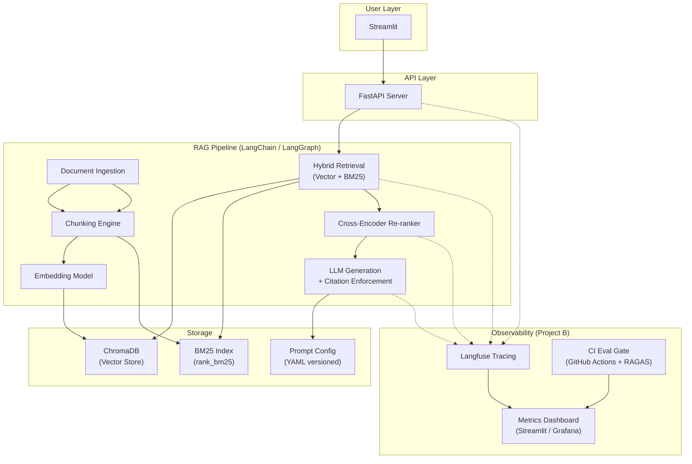

## 🎯 What We're Building & Why

We are building **two interconnected projects** that together demonstrate you can build *and operate* a production AI system:

1. **Project A — Production-Grade RAG System**: A domain-specific "Ask My Docs" system that retrieves relevant document chunks and answers questions with **proper citations**, using hybrid retrieval, re-ranking, and automated evaluation.
2. **Project B — Monitoring & Observability Layer**: A full instrumentation and quality-tracking layer on top of Project A — tracing every request, tracking quality metrics over time, and gating deployments on evaluation scores.

> **Why this combination?** Building the RAG system is ~30% of the work in real orgs. The remaining ~70% is knowing *whether it's working*, *why it fails*, and *fixing it fast*. This combo tells hiring managers: "This person thinks in systems, not just models."
> 

---

## 🧱 Prerequisites — What You Need to Know (and How Deep)

Below is everything you need *before* you start coding, organized by topic with depth guidance and the single best resource for each.

### 1. Python (Intermediate)

| **Topic** | **Depth Needed** | **Best Resource** |
| --- | --- | --- |
| Core Python | Functions, classes, decorators, type hints, file I/O, error handling | [Python Crash Course (book)](https://nostarch.com/python-crash-course-3rd-edition) — Ch 1-11 |
| Virtual environments | Create & manage with `venv` or `conda` | [Real Python — venv guide](https://realpython.com/python-virtual-environments-a-primer/) |
| Pydantic | Define models, validate JSON, handle errors | [Pydantic official docs — Getting Started](https://docs.pydantic.dev/latest/) |
| FastAPI basics | Create endpoints, request/response models, run with uvicorn | [FastAPI official tutorial](https://fastapi.tiangolo.com/tutorial/) |

### 2. LLM & Embedding Fundamentals (Conceptual)

| **Topic** | **Depth Needed** | **Best Resource** |
| --- | --- | --- |
| What are LLMs | Conceptual — tokens, context windows, temperature, top-p | [Andrej Karpathy — Intro to LLMs (YouTube, 1hr)](https://www.youtube.com/watch?v=zjkBMFhNj_g) |
| Embeddings | What they are, cosine similarity, why they enable semantic search | [OpenAI Embeddings Guide](https://platform.openai.com/docs/guides/embeddings) |
| Prompt engineering | System/user roles, few-shot prompting, chain-of-thought | [Prompt Engineering Guide (](https://www.promptingguide.ai/)[DAIR.AI](http://DAIR.AI)[)](https://www.promptingguide.ai/) |
| RAG concept | Retrieve → Augment → Generate pipeline, why it beats pure LLM | [LangChain RAG tutorial](https://python.langchain.com/docs/tutorials/rag/) |

### 3. Vector Databases & Search (Practical)

| **Topic** | **Depth Needed** | **Best Resource** |
| --- | --- | --- |
| ChromaDB | Create collection, add/query embeddings, metadata filtering | [ChromaDB Getting Started](https://docs.trychroma.com/docs/overview/getting-started) |
| BM25 keyword search | Conceptual — TF-IDF style scoring, when it beats vector search | [Pinecone — BM25 explained](https://www.pinecone.io/learn/bm25/) |
| Hybrid search | Combining BM25 + vector with reciprocal rank fusion | [LangChain Hybrid Search docs](https://python.langchain.com/docs/how_to/hybrid/) |

### 4. Git & CI/CD (Basic)

| **Topic** | **Depth Needed** | **Best Resource** |
| --- | --- | --- |
| Git basics | Clone, branch, commit, push, pull requests | [Git handbook (GitHub)](https://docs.github.com/en/get-started/using-git) |
| GitHub Actions | Write a basic workflow YAML that runs tests on PR | [GitHub Actions Quickstart](https://docs.github.com/en/actions/quickstart) |

### 5. Docker (Basic)

| **Topic** | **Depth Needed** | **Best Resource** |
| --- | --- | --- |
| Dockerfile & docker-compose | Build image, run containers, multi-service compose | [Docker Getting Started](https://docs.docker.com/get-started/) |

> ⏱️ **Estimated prereq ramp-up time**: If you already have fresher-level theoretical knowledge, budget **2–3 weeks** of focused study on the above before starting the build.
> 

---

## 🗺️ High-Level Architecture



---

## 📋 Master Execution Plan — 6 Phases

### Phase 0 — Environment Setup *(Days 1–2)*

- [ ]  Create a GitHub repo: `production-rag-system`
- [ ]  Set up Python 3.11+ virtual environment
- [ ]  Install core dependencies:

```
langchain / langchain-community / langchain-openai
chromadb
rank-bm25
sentence-transformers
ragas
langfuse
fastapi / uvicorn
streamlit
pydantic
python-dotenv
```

- [ ]  Create project structure:

```
production-rag-system/
├── src/
│   ├── ingestion/          # Document loading & chunking
│   ├── retrieval/           # Vector, BM25, hybrid, re-ranker
│   ├── generation/          # LLM call + citation logic
│   ├── evaluation/          # RAGAS eval scripts
│   ├── observability/       # Langfuse tracing + metrics
│   └── api/                 # FastAPI endpoints
├── prompts/                 # Versioned prompt YAML files
├── data/
│   ├── raw_docs/            # Your source documents
│   └── eval/                # Golden QA pairs
├── tests/
├── .github/workflows/       # CI pipeline
├── docker-compose.yml
├── requirements.txt
└── README.md
```

- [ ]  Get API keys: OpenAI (or Groq for free tier), set up `.env`
- [ ]  Initialize Git, first commit

---

### Phase 1 — Basic RAG Pipeline *(Days 3–10)* 🟢

**Goal**: Ingest docs → chunk → embed → retrieve → generate answer with citations.

#### Step 1.1 — Document Ingestion

- [ ]  Pick a domain corpus (suggestion: Python official docs, or a set of ~20-50 PDF research papers)
- [ ]  Build loaders for PDF (`PyPDFLoader`) and Markdown
- [ ]  Output: list of `Document` objects with text + metadata (source file, page number)

#### Step 1.2 — Chunking

- [ ]  Use `RecursiveCharacterTextSplitter`
- [ ]  Settings: `chunk_size=600 tokens`, `chunk_overlap=100 tokens`
- [ ]  Preserve metadata through chunking (source, page, chunk index)
- [ ]  **Why overlap?** Prevents losing context at sentence boundaries

#### Step 1.3 — Embedding & Vector Store

- [ ]  Embed chunks using `text-embedding-3-small` (OpenAI) or `all-MiniLM-L6-v2` (free, local)
- [ ]  Store in ChromaDB with metadata
- [ ]  Test: query a simple question, verify top-k chunks are relevant

#### Step 1.4 — Basic Retrieval + Generation

- [ ]  Retrieve top-5 chunks for a query
- [ ]  Build a prompt template that instructs the LLM to:
    - Answer based **only** on provided chunks
    - Cite the source (document name + chunk ID) for each claim
    - Say "I don't have enough information" if chunks don't support an answer
- [ ]  Use GPT-4o-mini or Groq (Llama 3.1 8B) as the LLM
- [ ]  Build a simple Streamlit UI to demo

#### ✅ Phase 1 Deliverable

> Show a document → ask a question → get an answer with exact citations pointing to source paragraphs.
> 

**Key learning**: You now understand the full Retrieve → Augment → Generate loop.

---

### Phase 2 — Production-Quality Retrieval *(Days 11–20)* 🟡

**Goal**: Hybrid search + re-ranking + citation enforcement + prompt versioning.

#### Step 2.1 — BM25 Keyword Index

- [ ]  Install `rank_bm25`
- [ ]  Index the same chunks with BM25
- [ ]  **Why?** Vector search is great for meaning, but BM25 catches exact terms/phrases that vector search sometimes misses

#### Step 2.2 — Hybrid Retrieval with Reciprocal Rank Fusion

- [ ]  For each query, get top-20 from vector search AND top-20 from BM25
- [ ]  Merge using Reciprocal Rank Fusion (RRF):

```python
# RRF formula: score = sum(1 / (k + rank)) across retrievers
def reciprocal_rank_fusion(results_list, k=60):
    fused_scores = {}
    for results in results_list:
        for rank, doc in enumerate(results):
            doc_id = doc.metadata["chunk_id"]
            fused_scores[doc_id] = fused_scores.get(doc_id, 0) + 1 / (k + rank + 1)
    return sorted(fused_scores.items(), key=lambda x: x[1], reverse=True)
```

- [ ]  Return top-10 fused results

#### Step 2.3 — Cross-Encoder Re-Ranker

- [ ]  Use `cross-encoder/ms-marco-MiniLM-L-6-v2` from sentence-transformers
- [ ]  Re-score the top-10 fused results by evaluating (query, chunk) pairs together
- [ ]  Return top-5 re-ranked chunks to the LLM
- [ ]  **Why?** Cross-encoders see query + chunk *together*, dramatically improving precision vs. bi-encoders

#### Step 2.4 — Citation Enforcement

- [ ]  Update the prompt to **strictly refuse** answering if no chunk supports the claim
- [ ]  Add post-processing: parse the LLM output, verify each citation ID exists in retrieved chunks
- [ ]  If citation is fabricated → flag and re-prompt or return "unsupported"

#### Step 2.5 — Prompt Versioning

- [ ]  Move all prompts to `prompts/v1.yaml`:

```yaml
version: "1.0"
system_prompt: |
  You are a helpful assistant. Answer questions using ONLY 
  the provided context chunks. Cite each claim as [Source: X, Chunk: Y].
  If the chunks do not support an answer, say "I don't have enough 
  information to answer this."
retrieval_prompt: |
  Given the question: {question}
  Retrieved context:
  {context}
  Provide a detailed answer with citations.
```

- [ ]  Load prompts from YAML in code — **never hardcode prompts**

#### ✅ Phase 2 Deliverable

> Hybrid retrieval + re-ranking returns significantly more precise results. System refuses to hallucinate. Prompts are versioned artifacts.
> 

---

### Phase 3 — Evaluation & CI Gating *(Days 21–28)* 🟡

**Goal**: Golden dataset + automated eval + CI pipeline that blocks bad changes.

#### Step 3.1 — Create Golden Evaluation Dataset

- [ ]  Manually create **50–100 QA pairs** from your documents:

```json
{
  "question": "What is the GIL in Python?",
  "ground_truth": "The Global Interpreter Lock is a mutex that...",
  "source_chunks": ["doc_python_threading_chunk_14"]
}
```

- [ ]  Store in `data/eval/golden_dataset.json`
- [ ]  **Why 50-100?** Enough to be statistically meaningful, small enough to manually verify

#### Step 3.2 — RAGAS Evaluation Script

- [ ]  Install `ragas`
- [ ]  Write `src/evaluation/eval_pipeline.py` that measures:
    - **Faithfulness** — Are claims in the answer supported by retrieved chunks?
    - **Answer Relevancy** — Does the answer address the question?
    - **Context Precision** — Are the retrieved chunks actually relevant?
    - **Context Recall** — Did we retrieve all the chunks needed?
- [ ]  Output a JSON report with scores

#### Step 3.3 — CI Pipeline (GitHub Actions)

- [ ]  Create `.github/workflows/eval.yml`:

```yaml
name: RAG Evaluation Gate
on: [pull_request]
jobs:
  evaluate:
    runs-on: ubuntu-latest
    steps:
      - uses: actions/checkout@v4
      - uses: actions/setup-python@v5
        with:
          python-version: '3.11'
      - run: pip install -r requirements.txt
      - run: python src/evaluation/eval_pipeline.py
      - name: Check thresholds
        run: |
          python -c "
          import json
          results = json.load(open('eval_results.json'))
          assert results['faithfulness'] >= 0.8, f'Faithfulness {results["faithfulness"]} < 0.8'
          assert results['answer_relevancy'] >= 0.75, f'Relevancy too low'
          print('✅ All quality gates passed!')
          "
```

- [ ]  **Why?** Every PR now automatically checks if your change broke RAG quality. This is how production AI teams work.

#### ✅ Phase 3 Deliverable

> A golden eval set, automated scoring with RAGAS, and a CI pipeline that **fails the build** if quality drops below thresholds.
> 

---

### Phase 4 — Observability & Tracing *(Days 29–38)* 🔴

**Goal**: Full request tracing, quality dashboards, cost tracking.

#### Step 4.1 — Langfuse Tracing Setup

- [ ]  Self-host Langfuse using Docker:

```yaml
# docker-compose.yml (add to existing)
services:
  langfuse:
    image: langfuse/langfuse:latest
    ports:
      - "3000:3000"
    environment:
      - DATABASE_URL=postgresql://...
      - NEXTAUTH_SECRET=your-secret
```

- [ ]  Instrument every RAG pipeline step with Langfuse traces:

```python
from langfuse.decorators import observe, langfuse_context

@observe(name="rag-pipeline")
def answer_question(query: str):
    # Each sub-step becomes a span in the trace
    with langfuse_context.observe(name="hybrid-retrieval"):
        chunks = hybrid_retrieve(query)
    
    with langfuse_context.observe(name="reranking"):
        reranked = rerank(query, chunks)
    
    with langfuse_context.observe(name="llm-generation"):
        answer = generate(query, reranked)
    
    return answer
```

- [ ]  For **every request**, you can now see:
    - Which chunks were retrieved
    - How the re-ranker reordered them
    - What prompt was sent to the LLM
    - The full response
    - Token count & latency per step

#### Step 4.2 — Quality Metrics Dashboard

- [ ]  Track these metrics over time (log to a simple SQLite or CSV, visualize in Streamlit):

| **Metric** | **What It Measures** | **Why It Matters** |
| --- | --- | --- |
| Latency P50 / P95 | Median and 95th percentile response time | Averages hide worst-case; P95 shows real user pain |
| Cost per request | $ spent on LLM tokens per query | Quantify operational cost at scale |
| Citation coverage % | % of answers with valid citations | Measures grounding quality |
| Failure rate | % of requests that error out or produce unsupported answers | System reliability signal |
| Retrieval hit rate | % of queries where at least 1 relevant chunk was retrieved | Diagnose retrieval vs generation issues |
- [ ]  Build a **Streamlit dashboard** with charts showing these metrics over time

#### Step 4.3 — Anomaly Detection & Alerting

- [ ]  Set thresholds (e.g., if P95 latency > 5s or faithfulness < 0.75)
- [ ]  Log alerts to console/file when thresholds are breached
- [ ]  **The interview story**: "Last Tuesday, faithfulness dropped to 0.6. I pulled up the dashboard, saw it correlated with a prompt change in v1.3, rolled back, and scores recovered."

#### ✅ Phase 4 Deliverable

> Every single request is fully traced. A dashboard shows quality metrics over time. You can diagnose *why* the system degraded on any given day.
> 

---

### Phase 5 — Regression Gating & Prompt Versioning *(Days 39–44)* 🔴

**Goal**: Connect eval + observability + CI into a single quality loop.

#### Step 5.1 — Prompt Version Tracking in Langfuse

- [ ]  Tag each trace with the prompt version (`v1.0`, `v1.1`, etc.)
- [ ]  Compare metrics across prompt versions in dashboard
- [ ]  **Why?** A prompt change can degrade quality as much as a code change

#### Step 5.2 — Regression Gating

- [ ]  Update CI pipeline to:
    1. Run RAGAS eval on golden dataset
    2. Compare scores against the **last passing baseline**
    3. If any metric drops more than 5% → build fails
- [ ]  Store baseline scores in `data/eval/baseline_scores.json`

#### Step 5.3 — End-to-End Integration Test

- [ ]  Write 5 integration tests that:
    - Send a query through the full pipeline
    - Assert the answer contains expected citations
    - Assert latency < 10s
    - Assert Langfuse trace was created

#### ✅ Phase 5 Deliverable

> Prompt changes are versioned and tracked. No change merges without passing quality gates. Full integration tests validate the system end-to-end.
> 

---

### Phase 6 — Polish & Portfolio Presentation *(Days 45–50)* ✨

- [ ]  Write a **killer README** with:
    - Architecture diagram (use the Mermaid diagram from above)
    - Setup instructions (one `docker-compose up` to run everything)
    - Demo GIF showing the UI
    - Evaluation results table
    - Observability dashboard screenshot
- [ ]  Record a **3-min Loom demo** walking through:
    1. Asking a question and showing cited answer
    2. Showing the Langfuse trace for that request
    3. Showing the metrics dashboard
    4. Showing CI pipeline passing/failing
- [ ]  Clean up code, add docstrings, type hints everywhere
- [ ]  Deploy on a free tier (Railway / Render / HuggingFace Spaces for the UI)

---

## 🛠️ Complete Tech Stack

| **Layer** | **Tool** | **Why This One** |
| --- | --- | --- |
| Orchestration | LangChain / LangGraph | Industry standard, great docs, composable chains |
| Vector Store | ChromaDB | Simple, local-first, perfect for learning |
| Keyword Search | rank_bm25 | Lightweight BM25 implementation in Python |
| Re-ranker | cross-encoder/ms-marco-MiniLM-L-6-v2 | Free, accurate, runs on CPU |
| LLM | GPT-4o-mini (or Groq free tier) | Cheap, fast, good quality |
| Embeddings | text-embedding-3-small (or all-MiniLM-L6-v2 free) | Good quality-to-cost ratio |
| Evaluation | RAGAS | Purpose-built for RAG eval, measures faithfulness/relevancy |
| Tracing | Langfuse (self-hosted) | Open-source, no usage limits, full trace visibility |
| API | FastAPI | Async, auto-docs, Pydantic integration |
| UI | Streamlit | Fastest way to build data app UIs in Python |
| CI/CD | GitHub Actions | Free for public repos, yaml-based |
| Containerization | Docker + docker-compose | One command to run everything |

---

## 📅 Timeline Summary

| **Phase** | **Duration** | **Key Output** |
| --- | --- | --- |
| Phase 0 — Setup | Days 1–2 | Repo, env, project structure |
| Phase 1 — Basic RAG | Days 3–10 | Working retrieval + cited answers |
| Phase 2 — Production Retrieval | Days 11–20 | Hybrid search, re-ranking, citation enforcement |
| Phase 3 — Eval & CI | Days 21–28 | Golden dataset, RAGAS, CI quality gate |
| Phase 4 — Observability | Days 29–38 | Langfuse tracing, metrics dashboard |
| Phase 5 — Regression Gating | Days 39–44 | Prompt versioning, regression CI, integration tests |
| Phase 6 — Polish | Days 45–50 | README, demo video, deployment |

> 💡 **Total: ~7 weeks** at 2-3 hours/day. Adjust based on your pace — the phases build on each other so don't rush.
> 

---

## 🎤 What You'll Be Able to Say in Interviews

After completing this project, you can confidently say:

1. *"I built a production RAG system with hybrid retrieval and cross-encoder re-ranking that improved precision by X% over naive vector search."*
2. *"I implemented citation enforcement — the system refuses to answer rather than hallucinate."*
3. *"I have a golden evaluation dataset and RAGAS-based CI pipeline that blocks merges when quality degrades."*
4. *"Every request is traced end-to-end with Langfuse. I can show you exactly which chunks were retrieved, how they were re-ranked, and what the LLM generated."*
5. *"I track P50/P95 latency, cost per request, and citation coverage over time. When quality dipped after a prompt change, I diagnosed it from the dashboard and rolled back."*

---

## 🚀 Next Steps — Start Here

1. **This week**: Complete the prerequisites checklist above — focus on areas where you feel weakest
2. **Next week**: Set up Phase 0 and start Phase 1
3. **Track progress**: Use this page's checkboxes to mark completed items

Let's build this. 💪